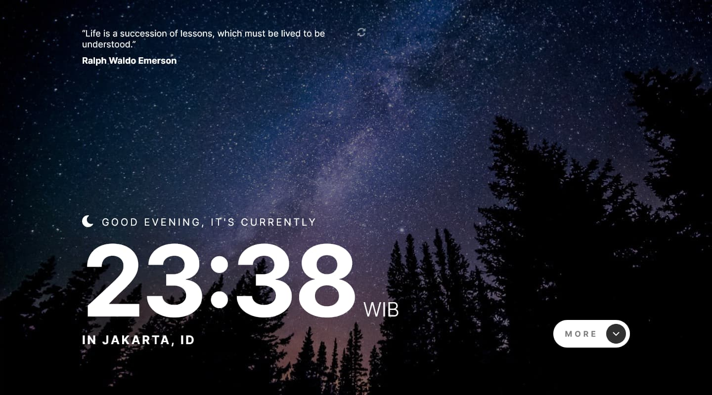

# Frontend Mentor - Clock app solution

This is a solution to the [Clock app challenge on Frontend Mentor](https://www.frontendmentor.io/challenges/clock-app-LMFaxFwrM). Frontend Mentor challenges help you improve your coding skills by building realistic projects.

## Table of contents

- [Frontend Mentor - Clock app solution](#frontend-mentor---clock-app-solution)
  - [Table of contents](#table-of-contents)
  - [Overview](#overview)
    - [The challenge](#the-challenge)
    - [Screenshot](#screenshot)
    - [Links](#links)
  - [My process](#my-process)
    - [Built with](#built-with)
    - [Continued development](#continued-development)
    - [Useful resources](#useful-resources)
  - [Author](#author)

## Overview

### The challenge

Users should be able to:

- View the optimal layout for the site depending on their device's screen size
- See hover states for all interactive elements on the page
- View the current time and location information based on their IP address
- View additional information about the date and time in the expanded state
- Be shown the correct greeting and background image based on the time of day they're visiting the site
- Generate random programming quotes by clicking the refresh icon near the quote

### Screenshot

### Links

- Solution URL: [Add solution URL here](https://your-solution-url.com)
- Live Site URL: [Add live site URL here](https://your-live-site-url.com)

## My process

### Built with

- [React](https://react.dev/) - JS library
- [Tailwind CSS](https://tailwindcss.com/) - For styles

### Continued development

- Expand the time details with animation

### Useful resources

Here are the API resources I used while working on this project:

- https://api.ipify.org?format=json
- http://www.geoplugin.net/json.gp?ip=xxx.xxx.xxx.xxx
- http://worldtimeapi.org/api/ip/xxx.xxx.xxx.xxx
- https://api.quotable.io/random

## Author

- [Website](https://vyonizr.com/)
- Frontend Mentor - [@vyonizr](https://www.frontendmentor.io/profile/vyonizr)
